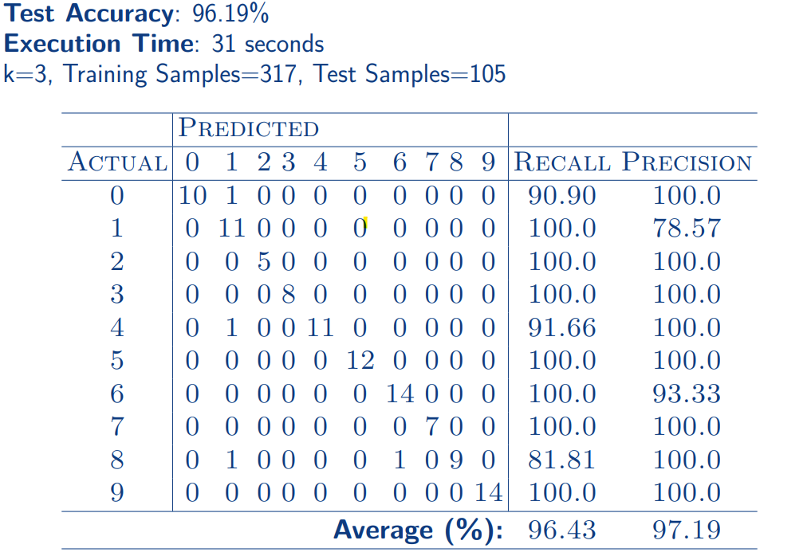
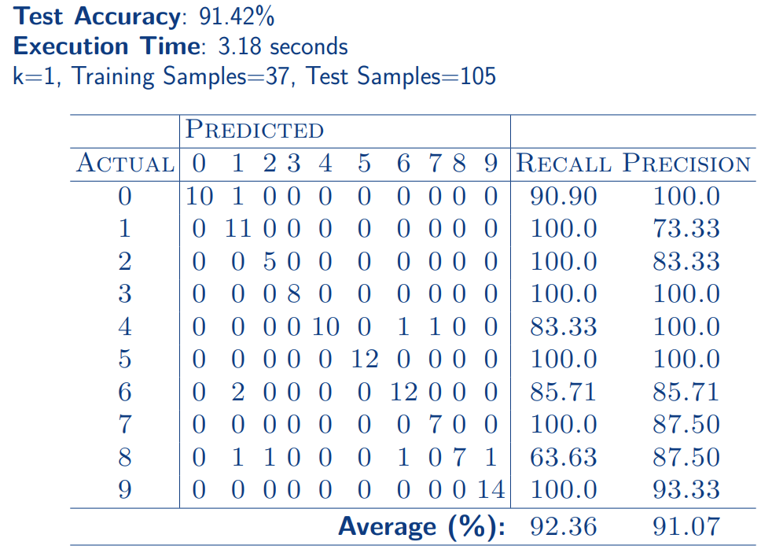
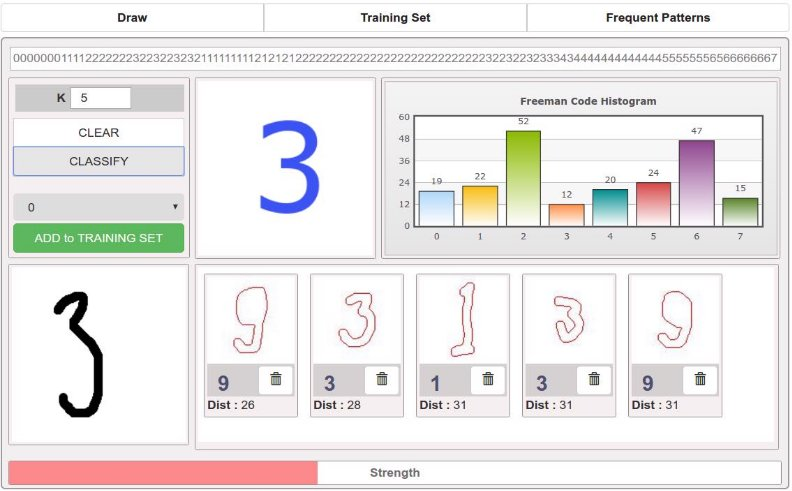

## Hand-Written Digit Recognition Spring Boot App 
> Tech Stack:
> >Spring Boot 4.x Web, Angularjs 1.x, Mongodb 2.6.x

**Demo Url:**  <https://hwdrapi-0-0-1.onrender.com/>
### Classifier

- K-Nearest Neighbor (kNN)
- Edit Distance
- Data Reduction
- Frequent Patterns
- Test Results
- Conclusion
- Demonstration

### Problem Definition

- Infinite different style of handwriting of characters.
- Easy for human to recognize a handwritten character.
- Difficult for a computer to recognize a handwritten character

### Objective

**Building a computer system recognizing with high accuracy handwritten characters in real time .**

- Only digits are drawn (0,1,2...9)
- Each draw is in 200x200 size grey channel image.
- For reducing complexity, images are rescaled to 100x100. 4 Grey scale image is binarized (Each pixel is 0 or 1)
- Unconnected components in draw are detected byIsland Algorithm

### Freeman Chain Code

Extracting features by encoding boundary (counter) of drawn digit with 8-directional clockwise chain-code structure. 
000010111212222222222322232323323323323331000...
A sample (drawn digit) has 2 attributes: A string and a label 8 317 samples in training set and 105 samples in testing set.
Using kNN for classification. Classification prediction is done by a majority vote of its neighbors. 3 kNN works by comparing distance (similarity) between samples.
Only one **String** feature for each sample. One user defined parameter**k** for kNN algorithm.

10 fold cross-validation to tune this parameter. Choosing best key according to minimum cost obtained. k=3 was found for kNN classifier.

6 Size of training set is an important norm for kNN.

### Levenshtein Distance

- String metric measuring the similarity between 2 sets of sequential characters.
- Cost for delete, insert and replace are 1 in **Levenshtein Distance**
- We use different costs for the operation being done on specific characters.
- Each character in the string representing boundary of drawn digit is a direction.
𝑚𝑖𝑛(|𝑑𝑖𝑟𝑒𝑐𝑡𝑖𝑜𝑛1 − 𝑑𝑖𝑟𝑒𝑐𝑡𝑖𝑜𝑛2|,8 − |𝑑𝑖𝑟𝑒𝑐𝑡𝑖𝑜𝑛1 − 𝑑𝑖𝑟𝑒𝑐𝑡𝑖𝑜𝑛2|)

𝐶𝑜𝑠𝑡(0,6) = 2 < 𝐶𝑜𝑠𝑡(0,3) = 3

- Our implementation is in brute force with𝑂(𝑛2) in time and space complexity.
- Complexity can be improved by dynamic programming.

### Reduce & Condense

- Number of samples for kNN algorithm increase computation complexity in time and space.
- Samples in training set can be grouped as **Outliers**, **Absorbed** and **Prototypes**.
- We need to find prototype samples which work with k=1 kNN model without loosing accuracy performance.
- Red, green and blue are same class samples.
- Red, blue and green samples are outliers, absorbed and prototypes respectively.
- By Reduce & Condense algorithms, we found prototypes (Green Samples)

### Mining Most Frequent Shapes
- GP-Growth and Apriori Algorithms for finding most frequent item sets.
- Our items (characters in a string) are sequential. Not suitable for those approaches.
- We implemented an GSP based (Generalized Sequential Pattern) algorithm: 
  - With some constraint specific to our data.
  - In our dataset, for example after direction 0, there will never be a direction 4. 
  - GSP depends on candidate generation.
- 2 user defined parameter. **support** for candidate frequent pattern and **pattern length**.
- 7 and 10 used respectively. 
- Frequent shapes can be used for poorly drawn digits.

**Evaluation Matrix for Not-Condensed Training Set**

Evaluation Matrix for Condensed Training Set

### Conclusion
1. Importance of modelling input to training data for a Machine Learning algorithm. 
   - **Freeman Code** ; representing a drawn digit as a string. 
   - **Preprocessing** ; rescaling, binarizing image
2. Efficiency of kNN Algorithm depends on parameter**k**, metric for similarity measurement and size of training set.
   - Tuning the model for**k** giving best results (k=3).
   - Reducing and Condensing training set to find**prototypes** of each class’s samples
   - Size of training set decreased to 37 from 317 by applying **Reduce/Condense** 
   - Computation and space complexity of our model drastically reduced while accuracy performance slightly decreased.
   
3. Test accuracies were 96.19% in 31 seconds and 91.42% in 3.18 seconds for
   - Not-Condensed and Condensed training sets respectively.

4. Extracted most frequent shapes (subset of freeman chain code) in drawn digits.
   - Customized GSP Based algorithm for sequential patterns.
   - Adapted to our problem. 
   - Frequent shapes can be used for classification.

